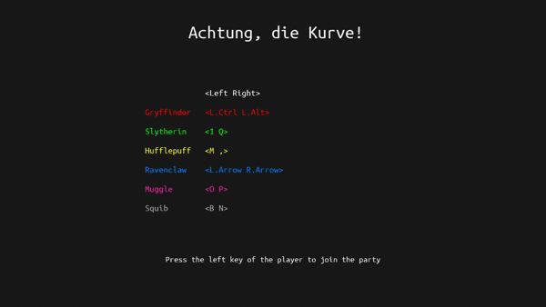
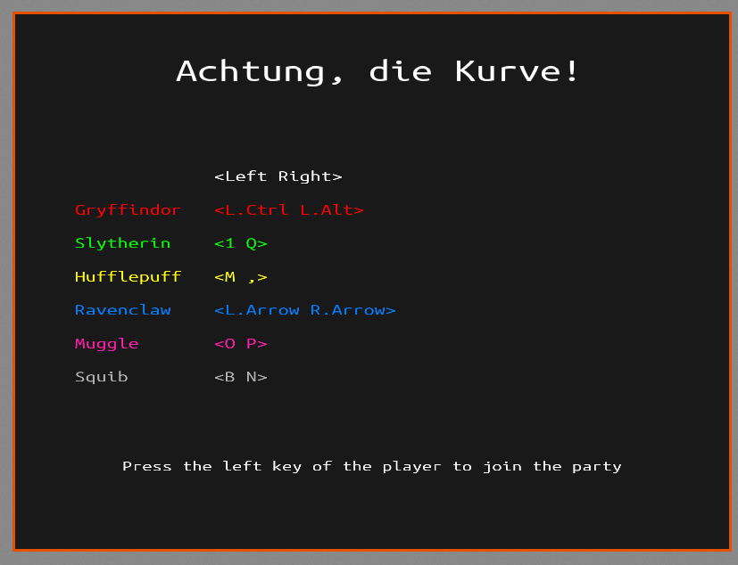
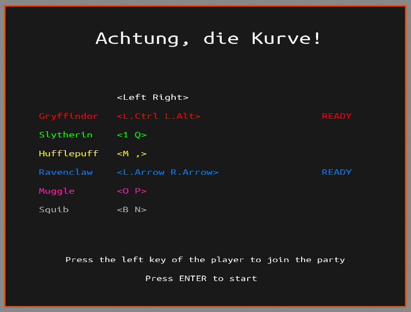
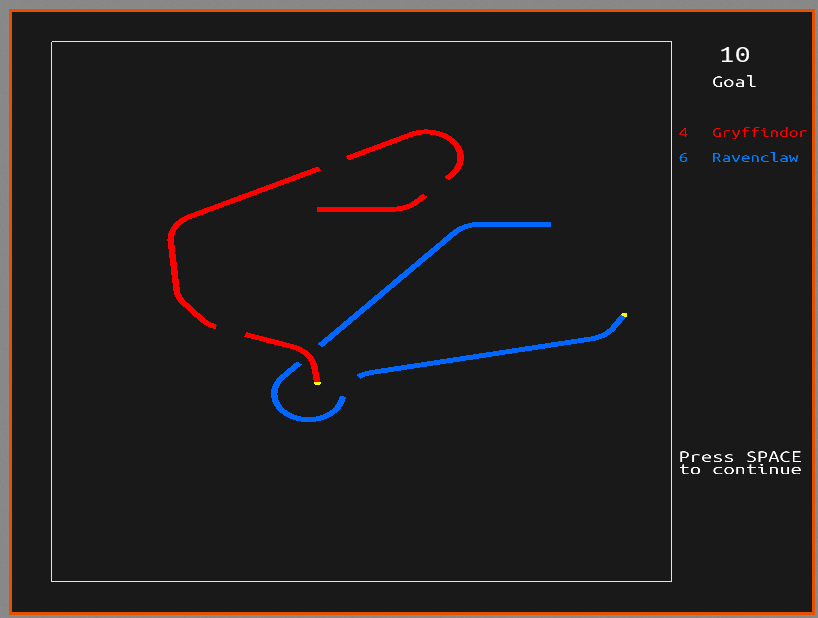

# Kurve

**Kurve** is a remake of the popular game "Achtung, die Kurve!".

<p align="center">
  
</p>

Table of contents
=================

<!--ts-->
   * [Getting Started](#getting-started)
      * [Install](#install)
      * [Debug](#debug)
   * [Roadmap](#roadmap)
   * [Built With](#built-with)
   * [Screenshots](#screenshots)
<!--te-->

## Getting Started

Clone this project.
```
$ git clone https://github.com/h-valdes/kurve.git
```

Install all the dependencies:
* [GLFW](https://www.glfw.org/)
* [FreeType2](https://www.freetype.org/)

### Install

Build the project
```
$ cd kurve
$ mkdir Release
$ cd Release
$ cmake -DCMAKE_BUILD_TYPE=Release ..
$ sudo make install
```

Enjoy
```
$ kurve
```

### Debug
To play without installing the game in your computer:
```
$ cd kurve
$ mkdir Debug
$ cd Debug
$ cmake -DCMAKE_BUILD_TYPE=Debug ..
$ make
```

Enjoy
```
$ ./kurve
```

## Roadmap
- [x] v0.1-alpha
   - [x] Minimal working implementation of "Achtung, die Kurve". It has all the
      features from the 1995 DOS version
   - [x] Random start position of the players
   - [x] Random length of lines (defined in a specific range)
   - [x] Menu to select the players
   - [x] Game Over screen
- [ ] v0.2-alpha
   - [x] Sort the name of the players in the Game Over screen depending on the
      number of points
   - [ ] Add a starting direction arrow in the transition zone (before starting)
   - [ ] Full Screen support
   - [ ] End the game when pressing Escape in the Menu
   - [ ] Read the configuration of the players from a file (txt, json, yaml, 
      etc)
   - [ ] Add a new general Menu (to choose between different options: config,
      exit the game, etc)
   - [ ] Migrate from the self built classes Point and Vector to GLM


## Built With

* C++
* OpenGL (glad)
* glm
* GLFW
* FreeType2

## Screenshots




